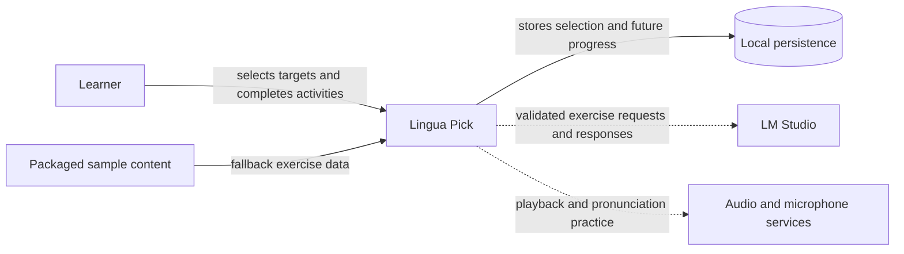
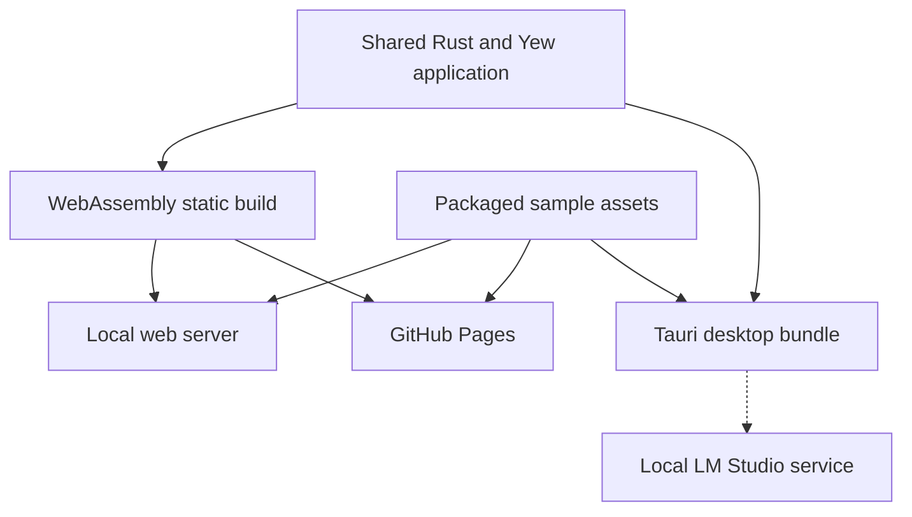

# Application architecture

This document describes the system at architectural boundaries rather than listing directories or assigning responsibility to individual files. Its structure follows the concerns in [arc42](https://docs.arc42.org/) and uses the abstraction-first approach described by the [C4 model](https://c4model.com/abstractions).

## Purpose and scope

Lingua Pick is a personal language-learning application with a Rust/Yew interface. A learner selects a target language, completes learning activities, and builds progress independently for each target. English is the source language. Regional varieties are separate learning targets.

The current product implements asynchronous catalogue loading, target selection, a target dashboard, browser persistence for the active target, ten-exercise sample single-choice sessions, and a migrated native DuckDB schema. Session outcomes are not connected to persistence yet. Generated exercises, durable cross-runtime progress records, populated statistics/history, dialogue sessions, speech input, and audio playback are planned.

## Architecture goals

- Run the same Yew application in a browser and in a Tauri desktop host.
- Deploy the browser build as static files, including on GitHub Pages.
- Keep learning models and session rules independent of browser and desktop APIs.
- Give every learning target a stable identity and an independent content boundary.
- Treat generated exercises as untrusted input until they pass structural and semantic validation.
- Keep progress isolated by target and preserve it across sessions.
- Add exercise formats without coupling the domain model to one writing system or one UI interaction.

## Constraints

- The shared learning domain uses `no_std` with `alloc`.
- Browser runs cannot depend on a local model server or native operating-system features.
- GitHub Pages provides static hosting and no application backend.
- Local storage is required for browser persistence; startup fails clearly when it is unavailable.
- The long-term catalogue contains 400 learning options, with regional varieties counted separately.
- The catalogue describes discoverable targets. It does not prove that complete learning content exists for every target.

## System context

Solid connections are implemented in at least one runtime. Dashed connections describe planned capabilities. LM Studio is available only through a trusted desktop/native boundary; a static browser deployment must not assume access to it.

## Solution strategy

The application separates portable learning rules from platform capabilities and presentation:

1. The learning domain defines stable identifiers, exercise data, validation, grading, and session transitions.
2. Target modules provide target-specific vocabulary, curriculum, writing-system rules, and supported exercise formats.
3. The application layer coordinates the selected target, sessions, progress, and capability-dependent services.
4. The Yew interface renders the current application state and emits learner actions.
5. Runtime adapters provide storage, static sample loading, model generation, audio, and microphone access when the environment supports them.

Dependencies point toward the learning domain. Domain rules do not call browser APIs, Tauri commands, storage, or UI code.

## Architectural building blocks

| Building block | Architectural role |
| --- | --- |
| Learning domain | Portable types and rules for targets, exercises, answers, grading, and sessions. |
| Target modules | Knowledge and constraints specific to one learning target or regional variety. |
| Application state | Coordinates the active target, current session, progress, and recoverable errors. |
| Yew interface | Presents navigation and exercises, maintains transient interaction state, and exposes accessible controls. |
| Web component libraries | Supply reusable shell and exercise presentation without owning routes, application state, or providers. |
| Content catalogue | Supplies stable target identifiers and display/search metadata. |
| Persistence adapter | Stores the selected target and, in the future, versioned progress and history. |
| Native learning store | Applies transactional DuckDB migrations and stores canonical session and exercise history for the desktop runtime. |
| Exercise provider | Obtains authored samples or generated candidates through a common application boundary. |
| AI facade | Validates target/category requests and admits provider output only through core session validation. |
| Platform API adapter | Detects the web runtime and exposes typed Tauri commands without coupling UI components to JavaScript invocation details. |
| Tauri host | Supplies trusted desktop capabilities such as local model access while hosting the same web interface. |

The architecture deliberately describes these roles without mapping every role to a source file. Source layout can change without changing the system design.

## Runtime views

### Select a target

1. The application mounts a loading screen and requests the catalogue as a static HTTP asset.
2. It checks the response, parses the JSON, and validates catalogue invariants before creating learning state.
3. It obtains browser storage and restores a saved stable target identifier when one exists.
4. The learner searches the catalogue and selects a result.
5. Shared application state changes first, then the persistence adapter saves the selection.
6. The router opens the target dashboard. The shared top bar continues to show the active target.
7. A failed write leaves the in-memory choice active and surfaces a persistence warning.

### Start an exercise in a browser

1. The learner chooses **Run exercise** from the target dashboard.
2. Runtime capabilities select the packaged-sample exercise provider.
3. The provider loads the sample associated with the active target.
4. The application validates the data and constructs a session containing exactly ten exercises.
5. The UI renders the supported exercise and advances through the session.

This flow is implemented for the available single-choice samples. Unsupported targets, malformed samples, and batches containing anything other than ten exercises produce explicit errors.

### Generate an exercise on desktop

1. The learner chooses categories and an exercise format.
2. The AI facade validates the request and sends it through the desktop exercise provider.
3. The provider invokes the native `send_prompt` command, which asks LM Studio for a schema-constrained ten-exercise batch.
4. The response passes size, syntax, schema, semantic, target, category, and session validation.
5. Only a complete validated batch enters a session.
6. The application discards stale responses when the learner changes target or starts a newer request.

The prompt command and frontend IPC adapter are implemented. Exercise request construction, response parsing, and session integration remain planned. The contracts are defined in [AI interaction](ai-interaction.md) and [LM Studio integration](llm-integration.md).

### Record learning progress

1. A session emits evidence such as exposure, completion, practice, or assessed performance.
2. The application associates the evidence with the active target and content identifiers.
3. The persistence adapter writes a versioned progress record and history event.
4. Statistics derive from stored evidence; missing evidence remains unknown knowledge.

Dialogue contributes exposure and ungraded completion. Pressing **Continue** must not manufacture a correct answer. This flow is planned and specified further in [learner progress](progress.md) and [dialogue](exercises/dialogue.md).

## Deployment view

| Environment | Available exercise source | Native capabilities |
| --- | --- | --- |
| Local browser | Packaged samples | Browser APIs only |
| GitHub Pages | Packaged samples | Browser APIs only |
| Tauri desktop | Packaged samples; planned local generation | Trusted commands and a migrated DuckDB schema in the application data directory; persistence commands are pending |

Runtime detection selects capabilities rather than changing domain behavior. Details and current limitations live in [runtime environments](runtime.md).

## Cross-cutting concepts

### Stable identity

Target identifiers are durable data keys. Display names, native names, regions, aliases, and artwork can change without changing identity. Progress, history, samples, and generated requests use the same target identifier.

### Validation and trust boundaries

Catalogue data, persisted data, static exercise files, and model output are inputs that can be invalid. Parsing alone is insufficient. Data must satisfy domain invariants before it reaches a session. Model output never controls component names, HTML, styles, routes, or executable behavior.

### Runtime capabilities

Features depend on declared capabilities such as sample loading, generation, audio playback, or microphone input. UI availability and error messages derive from those capabilities. Domain models remain platform-neutral.

### Frontend module boundaries

Reusable shell primitives and exercise presentation live in dedicated web component libraries. They accept typed properties and callbacks and do not depend on application routes, shared app state, or exercise providers. Page composition and session orchestration stay in the application until those dependencies have stable interfaces. Runtime detection and Tauri invocation sit behind the platform API adapter, so adding native commands does not spread JavaScript bridge details through components.

### Persistence and migration

Persisted formats use stable identifiers and explicit versions. Selection and progress have separate records and failure handling. Progress belongs to a target, so switching targets does not merge unrelated evidence. The desktop store applies immutable, checksummed SQL migrations transactionally. Browser persistence requires its own versioned adapter. Format changes require migration or a documented reset policy. The detailed native contract is in [native storage](storage.md).

### Asynchronous consistency

Every asynchronous request is bound to the target and request identity that created it. Completion handlers reject stale results after target changes, navigation, cancellation, or replacement requests.

### Accessibility

Keyboard navigation, focus, accessible names, status announcements, and alternatives to audio or microphone interaction are architectural quality requirements rather than optional finishing work.

## Architectural decisions

- English is the fixed source language; the learner selects only a target.
- Regional varieties have independent target identifiers and content boundaries.
- Hash routing keeps navigation compatible with static GitHub Pages hosting.
- The browser build uses packaged exercises when trusted local generation is unavailable.
- The learning domain stays portable through `no_std` and `alloc`.
- Dialogue is an ungraded exposure activity; microphone practice is not evidence of pronunciation quality without an assessment system.
- The active target is shared application state and remains visible across learning screens.

Significant future decisions should receive a short decision record as described in [documentation standards](documentation-standards.md).

## Quality requirements

| Quality | Required behavior |
| --- | --- |
| Portability | Core learning rules compile without the standard library and behave consistently across web and desktop hosts. |
| Integrity | Invalid catalogue, persisted, sample, or generated data cannot silently become a valid session. |
| Resilience | Recoverable write and provider failures preserve valid in-memory state and explain the consequence to the learner. |
| Accessibility | Core selection, navigation, and exercise flows work by keyboard and expose meaningful semantics. |
| Extensibility | A new exercise format or target can be added without modifying unrelated formats or targets. |
| Traceability | Progress evidence identifies its target, activity type, time, and whether it was assessed. |
| Static deployability | The browser application functions without server-side routes or application APIs. |

## Risks and technical debt

- Exercise generation has a documented contract but no connected desktop provider.
- Native progress and history storage exists, but the active session flow does not write to it and browser persistence remains pending.
- Only a small subset of targets has sample exercise content.
- Dialogue, translation, matching, audio, and microphone interactions do not yet have complete renderers.
- Local browser storage is origin-specific and does not synchronize between devices or deployments.
- The target catalogue must grow from 100 to 400 options while preserving existing identifiers.
- Generated-answer quality and grading policy need evaluation before generated content can affect assessed progress.

## Related specifications

- [Project glossary](glossary.md)
- [Learning core](learning-core.md)
- [Runtime environments](runtime.md)
- [UI specification](ui.md)
- [Exercise specifications](exercises/README.md)
- [Learner progress](progress.md)
- [AI interaction](ai-interaction.md)
- [LM Studio integration](llm-integration.md)
- [Exercise coverage](exercise-coverage.md)
